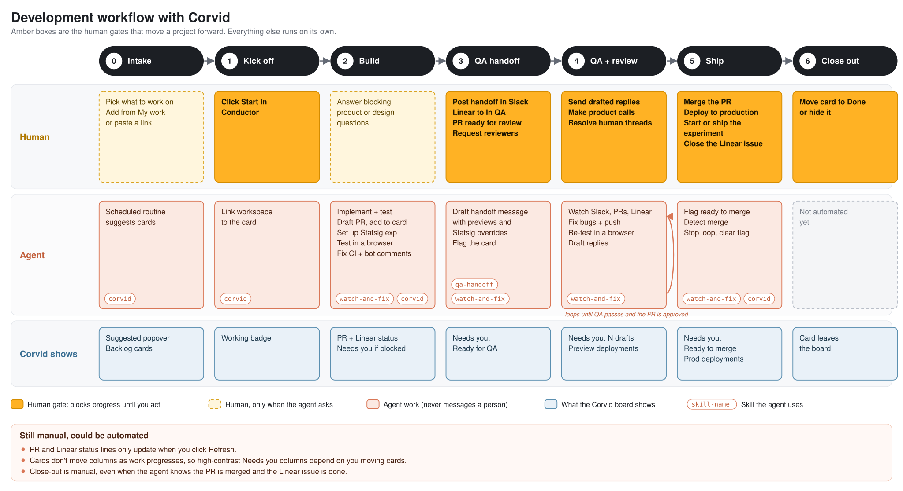

# Corvid

A local, single-user Kanban board that links ad-hoc tasks to GitHub PRs and Linear
issues and shows their live status as badges. Runs entirely on your machine, with
no database and no accounts: state is a flat `tasks-data/data.json` file.

It's built for the "what am I actually working on right now" problem, where the
answer is spread across a dozen PRs, a few Linear issues, and some deploys.

## Requirements

| | Needed for | Notes |
| --- | --- | --- |
| **Node 18+** | everything | `node -v` |
| **[`gh` CLI](https://cli.github.com/)**, logged in | GitHub PR badges | `gh auth status`. The app shells out to `gh api graphql`, so there's no token to manage. |
| Linear API key | Linear badges | Optional. Set `LINEAR_API_KEY` in `.env.local`. |
| **[Vercel CLI](https://vercel.com/docs/cli)**, logged in | Deployments sidebar | Optional. `vercel login`. The app reads the token the CLI stored; no `.env` entry needed. |

Only Node and `gh` matter for the core experience. Skip Linear and Vercel and
those features simply stay empty.

## Setup

```bash
git clone https://github.com/JakeDawkins/corvid.git
cd corvid
npm install

# Optional: Linear key and/or overrides
cp .env.example .env.local
$EDITOR .env.local

npm run dev
```

Then open **http://localhost:5473**. The API server runs on `:8787` and Vite
proxies `/api` to it, so you only ever visit the Vite URL in dev.

To run it as one process instead:

```bash
npm run build && npm start   # http://localhost:8787
```

`npm start` serves the built frontend from the same Express server.

## What it does

- **Kanban board** with columns you define yourself; drag cards between them.
  Add, rename, or delete columns from the Settings page (gear icon); they live in `data.json`.
  Settings > Highlighted columns gives any column a light accent tint so it stands out.
- **Card details**: clicking a card opens it as a detail view, with everything
  editable in place: click the title, notes, or a link's label or URL to change
  it. Linked PRs and Linear items show their live status (refreshed when the
  card opens). Paste a URL anywhere on an open card, or into the link box, and
  the label box is focused so you can name it before pressing Return.
- **Cards** are either ad-hoc (just a title) or a bundle of links: any number of
  GitHub PRs, Linear issues/projects, and freeform links (Slack, Notion, Figma, …).
  Paste a GitHub PR or Linear URL into the quick-add box and it resolves the
  title for you.
- **Refresh** pulls live status for every linked item on non-hidden cards:
  - **PR:** open / merged / closed / draft, CI rollup (✓ / ✗ / …), review decision
    (approved / changes requested / review required), and unresolved review
    thread count.
  - **Linear:** the issue or project's workflow state, in its own color, plus any
    attached Notion/Figma resources.
- **Inbox** ("My work" sidebar): your open PRs across every repo, plus Linear
  issues assigned to you and projects you lead. One click adds any of them to the
  board.
- **Deployments** sidebar: live Vercel deployment status per project, production
  and preview together, across your personal account and every team you belong to.
  Per-project show/hide toggles.
- **Complexity** meter (XS–XL) and per-card color tags for grouping.
- **Copy prompt for agents**: turns a card into a paste-ready prompt with its
  title, notes, and links, for handing to a coding agent.
- **Agent activity**: link one or more Conductor workspaces to a card and each
  shows as a badge at the top of the card. A badge turns Claude orange and reads
  "Working", with a spinning Claude mark, while an agent is working in that
  workspace, and "Waiting", with a pulsing mark, while the agent is idle but
  will resume on its own (a background task or Monitor is running, or a `/loop`
  wakeup is scheduled; hover for what it's waiting on). The copied agent prompt tells the agent to link its own workspace
  via the skill. The server reads Conductor's local database
  read-only every 3s (macOS; override the path with `CONDUCTOR_DB`).
- **Needs you**: when something is waiting on you, the agent flags
  the card (via the skill) with what's waiting and what to do next, and clears
  the flag once nothing is waiting on you anymore. The flag is a solid amber banner in
  the columns you pick in Settings and a muted one everywhere else, so the
  columns you care about stand out without the whole board shouting. You can
  also clear it yourself from the card editor.
- **Start in Conductor**: pick a repo on the card (from the repos added to
  Conductor) and the button opens a new Conductor workspace in it, seeded with
  the agent prompt via a `conductor://` deep link. With no repo set, it asks for
  one first and saves it on the card. Once a card has a linked workspace, the
  header shows a link to it instead of this button and Copy prompt.
- **Hide/unhide** cards, with a toggle to reveal hidden ones.
- **Search** (Cmd+K, or the magnifying glass): find any card by title, Linear
  task id, link title, or URL, in that order of priority. Arrow keys pick a
  result and Return opens it, saving and replacing any card already open in
  the editor.
- **Auto-save**: closing a card with Done, Escape, or a click outside saves
  your edits. Only Discard changes throws them away.
- **Import / Export** the full state as JSON.
- **Masked mode** (Settings, or Shift+M): swaps titles, notes, and other
  sensitive text for placeholder words so the board can be screenshotted
  publicly. Choose which kinds of text to mask; stored data is never changed.

## The development workflow

Corvid is built for running several coding agents at once. Agents do the work
from kickoff to merge; you step in only at a handful of gates, and the board
tells you when one is waiting on you.



Amber boxes are the human gates. Everything else runs on its own. (The diagram
is generated by `docs/workflow.py`; edit that and rerun it to change it.)

### Step by step

0. **Intake.** Work lands in Backlog from My work, a pasted link, or the
   "Suggested by Claude" routine. You pick what's next.
1. **Kick off.** On the card, **Start in Conductor** opens a workspace in the
   card's repo, seeded with the agent prompt. The agent links its workspace, so
   the card shows a **Working** badge.
2. **Build.** The agent works on its own with the `watch-and-fix` skill: it
   implements and tests the change, opens a draft PR and adds it to the card,
   sets up a Statsig experiment if the spec calls for one, tests UI changes in a
   browser, and keeps CI green. It flags **Needs you** only if a decision
   blocks it.
3. **QA handoff.** It drafts the Slack message handing off to QA (preview links,
   Statsig link and test overrides, what to check) and flags the card "Ready for
   QA". You post it, move the Linear issue to QA, and mark the PR ready for
   review.
4. **QA and review.** It watches Slack (every channel, since feedback doesn't
   always land in the right one), the PRs, and Linear. It fixes bugs, re-tests,
   pushes, and drafts replies. You send the replies and make product calls. This
   repeats until QA passes and the PR is approved.
5. **Ship.** It flags "Ready to merge". You merge, deploy, start or ship the
   experiment, and close the Linear issue. It sees the merge, stops watching,
   and clears the flag.
6. **Close out.** You move the card to Done or hide it.

### Day to day

- Keep the board open. In **Settings > Needs you**, turn on high-contrast flags
  for the columns where waiting work matters, such as In Progress and In Review.
  An amber banner there means an agent is waiting on you, and it says why and
  what to do.
- To respond, click the card's workspace badge to open its Conductor workspace.
  Drafted messages are there, ready to copy.
- Run as many cards in parallel as you like. **Working** badges show which
  agents are busy; **Needs you** banners show which are waiting.

### What agents will and won't do

- **Never without asking:** send a message to a real person. That covers Slack
  messages and reactions, Linear comments, GitHub comments and review replies,
  and @-mentions anywhere. Agents draft the message and flag the card instead.
- **Left to you:** anything that signals people or is hard to undo. That means
  marking a PR ready for review, requesting reviewers, changing a Linear issue's
  status, merging, deploying to production, and starting or shipping an
  experiment.
- **Theirs:** code, tests, pushes to the project branch, draft PRs, bot review
  comments, Statsig experiments in Setup with test overrides, browser testing,
  and keeping the card up to date.

### Setup

- [Conductor](https://conductor.build), with your repos added.
- The `corvid` and `watch-and-fix` skills available in every session. Link them
  into your user skills from the board's checkout, so a `git pull` updates
  them everywhere:

  ```bash
  ln -s "$PWD/.claude/skills/corvid" ~/.claude/skills/corvid
  ln -s "$PWD/.claude/skills/watch-and-fix" ~/.claude/skills/watch-and-fix
  ```

- Agent access to Slack, Linear, and Statsig (MCP servers), plus a logged-in
  `gh` CLI.
- Optional: a `qa-handoff` skill for your team's handoff format, a team Statsig
  skill with your experiment conventions, and a browser automation skill such
  as `agent-browser`.

## How it's wired

```
browser (Vite + React, :5473)
   |  /api/*  (proxied)
Express server (server/index.js, 127.0.0.1:8787)
   |-- gh CLI  -> GitHub GraphQL      (your existing gh auth)
   |-- fetch   -> api.linear.app      (LINEAR_API_KEY)
   |-- fetch   -> api.vercel.com      (Vercel CLI token or VERCEL_TOKEN)
   |-- sqlite3 -> Conductor's DB      (read-only, agent activity)
   `-- tasks-data/data.json           (all state)
```

- **Frontend:** Vite + React + TypeScript, no state library. `src/App.tsx` holds
  the board; `src/types.ts` is the full data model and the best place to start
  reading.
- **Server:** one ~600-line Express file. It owns every credential and every
  outbound call, so nothing sensitive is ever handed to the browser. It binds to
  `127.0.0.1` only and has no auth of its own; don't expose it.
- **Storage:** `tasks-data/data.json` (git-ignored), which also caches the
  last-fetched status for each PR/issue so badges survive a reload. It lives in
  its own directory so you can sync just `tasks-data/` to Dropbox/Drive without
  dragging along `node_modules`.
- **External edits:** the server watches `data.json` and pushes a server-sent
  event when something other than the UI changes it, so the board reloads
  itself. That makes it safe for a script or coding agent to edit the board file
  directly while it's open.

## Data file

`tasks-data/data.json` is created on first save. The shape (see `src/types.ts`
for the authoritative version):

```jsonc
{
  "columns": ["Todo", "In Progress", "In Review", "Done", "Suggested by Claude"],
  "cards": [
    {
      "id": "abc123",
      "title": "Fix checkout redirect",
      "column": "In Review",
      "hidden": false,
      "complexity": "S",
      "links": [
        { "label": "PR", "url": "https://github.com/acme/acme-web/pull/123" },
        { "label": "Issue", "url": "https://linear.app/acme/issue/ENG-42/..." }
      ],
      "workspaces": ["1037e896-2225-4a69-8609-03832bde673e"],
      "repo": "/Users/jane/code/acme-web"
    }
  ],
  "cache": { "prs": {}, "issues": {} },
  "colorTags": { "#3b9eff": "sales" },
  "repoNames": { "acme/acme-web": "web" },
  "hiddenRepos": ["acme/old-app"],
  "hiddenVercelProjects": ["acme-docs"],
  "needsYouColumns": ["In Review"],
  "highlightedColumns": ["In Progress"]
}
```

Two conveniences worth knowing:

- `repoNames` overrides the repo label on PR rows, keyed by `owner/repo`
  (case-insensitive). The example above shows `web #123` instead of
  `acme/acme-web #123`.
- `hiddenRepos` (`owner/repo`) leaves those repos' PRs out of My work, and
  `hiddenVercelProjects` (project names) leaves those projects out of
  Deployments. Both are case-insensitive and editable on the Settings page.
  PRs from archived repos are always left out of My work.
- Any column whose name contains "claude" is treated as a suggestions column and
  moved out of the main board into its own toolbar popover with a count badge.
  It's an ordinary column otherwise, useful as a drop target for an agent that
  proposes work.

## Editing the board from an agent

The repo ships a [Claude Code](https://claude.com/claude-code) skill at
`.claude/skills/corvid/` that lets an agent read and edit the board for you:
"add this PR to the checkout card", "move the redirect card to In Review",
"what's in my Todo column". Clone the repo and Claude Code picks it up
automatically when you work in this directory.

It drives `.claude/skills/corvid/scripts/tracker.mjs`, a standalone Node script
with no dependencies, so it's equally usable by hand or from any other agent:

```bash
S=.claude/skills/corvid/scripts/tracker.mjs
node $S where                 # which data.json am I pointed at?
node $S columns               # columns, card counts, color tags
node $S list --all
node $S add-link "checkout redirect" https://github.com/acme/acme-web/pull/317
node $S link-workspace "checkout redirect"   # links $CONDUCTOR_WORKSPACE_ID
node $S set "checkout redirect" --column "In Review" --complexity L
node $S needs-you "checkout redirect" --reason "Plan ready" --action "Approve it in the workspace"
node $S clear-needs-you "checkout redirect"
node $S add-card --title "New task" --column Todo --top
node $S add-column "Suggested by Claude"
```

Every mutation targets exactly one card, matched by uuid, title substring, or
link substring; an ambiguous match aborts with the candidates rather than
guessing. It refuses to write if any other card or the card ordering would
change, backs the file up to `~/.pr-tracker-backups/` first (last 20 kept), and
takes `--dry` to preview. Because the server watches `data.json`, an open board
picks up these edits on its own.

The repo also ships a `watch-and-fix` skill at `.claude/skills/watch-and-fix/`
for working on a card's project autonomously: it builds the change, drafts the
QA handoff, then watches Slack, GitHub PRs, and Linear for feedback and fixes
what's relevant until the project is done. It never messages a real person on
its own; it drafts the reply and flags the card as **Needs you** instead. The
copied agent prompt asks agents to use it.

There's also an optional scheduled routine that fills a "Suggested by Claude"
column with work worth picking up — see
[docs/suggested-tasks-routine.md](docs/suggested-tasks-routine.md).

By default it targets `tasks-data/data.json` in the repo the skill ships inside,
resolved from the script's own location rather than the working directory. If
your board lives in a different checkout, point `PR_TRACKER_DIR` at it. Linked
git worktrees are refused, since their git-ignored `tasks-data/` is an empty
decoy board.

## Notes and limits

- Single user, single machine, no auth. It is not built to be hosted.
- `tasks-data/` and `.env.local` are git-ignored, so your task list and keys
  never get committed. Use **Export** for backups; **Import** restores.
- CI state comes from GitHub's status-check rollup on the PR's latest commit.
  PRs with no checks show no CI badge.
- Unresolved thread count reads up to 100 review threads per PR.
- The inbox reads up to 100 open PRs and 100 Linear issues/projects.
- Status is fetched on demand, not polled. Hit **Refresh** when you want it
  current.

## License

MIT. See [LICENSE](LICENSE).
